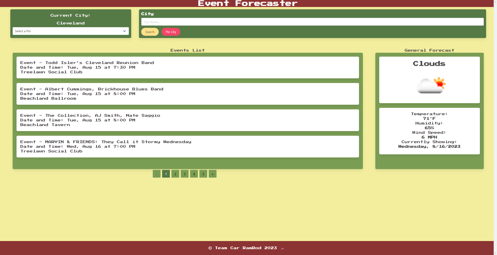

# CWRU Bootcamp Project 1 - Event Forecaster

## Description

1. In this project, our main goal was to create an event forecaster, a program that would pull data from both the Ticketmaster API and OpenWeather API to display a list of events, that once clicked on, will give general weather information for a given day!

2. Dates for this project were selected and formatted using DayJS!

3. A big focus of this project was combining two server-side APIS, which I believe we accomplished relatively seamlessly!
                                                                       
4. We decided to use Bulma for our CSS Framework and it allowed for us to impliment easy to use formatting, dropdowns, boxes and pagination!

5. For the OpenWeather API, we ended up having to use two seperate API call links and then using internal logic to determine which path the weather would go! (Current day on one path, any day in the future on the other.)

6. For the Tickermater API, we used global variables for the different dates to setup the timeframe for the call, and then would append the items to the list on the page using JQuery DOM traversal.

7. This project for all of us was the first collaberative coding effort, so it was a fantastic learning experience for working in a team, merge conflicts and just overall understanding GitHub's group functionality!

## Installation and Usage

<p>Simply use the download all of the files provided and open the index.html in your file viewer of choice!
To look at the source code, open it, the CSS file and the Javascript file in a text file editor of choice!

If your plan is to just take a look at functionality, feel free to use the link to the deployed page given below!</p>


## Mockup:
<h3>The following images shows the web application's appearance and functionality:</h3>



## Planned Features:

```
* Ability to filter event searches by given criteria (ex. concert, sports, time frame, etc.)

* Extended event list (increased from the current standard list being 20 of the most upcoming events in a given city)

* Adding action to clicking on an event that will show user more information about the event (ex. ticket links, location on map, etc.)

```

## Credits
<br>
  <h3>Editing of code done by Team Car RamRod 🏎️</h3> <br>
  
  ☀️ Weather API functionality handled by <b>Anthony Iacano</b>, <b>Logan High</b> ☀️<br><br>
  🎫 TicketMaster API functionality handled by <b>Cameron Rawlins</b>, <b>Howard Pifer</b>! 🎫<br><br>
  📃 Bulma CSS styling handled by <b>Chad Smith</b>! 📃
 <br>
 <br>
 <br>
 <h3>Javascript Libraries used within the project: </h3>
 <i>JQuery<br>DayJS</i>
 <br>
 <br>
 <h3>CSS Framework(s) used within the project: </h3>
  <i>Bulma</i><br><i>Google Fonts</i>
 <br>
 <br>
 <h3>Server-side APIs used within the project:</h3>
 <i>Ticketmaster</i><br><i>OpenWeather</i> 
 <br>
 <br>
 <h3>Lesson provided by:</h3>
 edX Boot Camps LLC.
 <br>

## Link to Deployed Page

 https://anthony-gg.github.io/event-forecaster/

 ## License

Please reference the **LICENSE.MD** file inside of the repository.

---